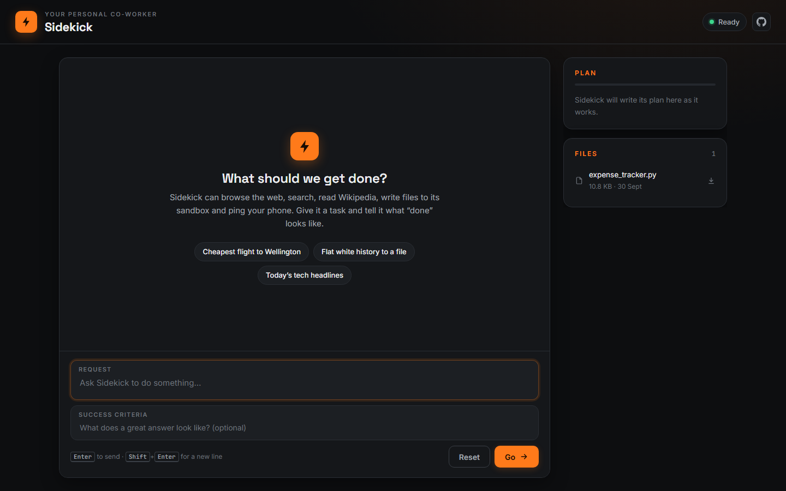

# sidekick

[](https://www.python.org/)
[](static/app.js)
[](static/index.html)
[](static/styles.css)
[](https://docs.langchain.com/)
[](LICENSE)

**sidekick** is my personal co-worker: a general-purpose AI agent that can drive a real web browser, search the web, read Wikipedia, write files to a sandbox, and send a push notification to my phone. I use it for everyday tasks and planning first, then study and research, travel and shopping, and job hunting. I give it a task plus what "done" looks like, and it keeps working until an evaluator agrees the job is actually finished.

## Preview



## How it works

1. **The worker** is a LangChain `create_agent` running `gpt-5.4-mini`. It searches the web (Serper, with links and dates), reads pages as plain text, looks things up on Wikipedia, drives a real browser through Playwright MCP when a page needs clicking or JavaScript, reads and writes files through a filesystem MCP server locked to `sandbox/`, and can send push notifications through Pushover. Its prompt tells it to research in parallel batches, cite every source with a date, and always deliver the result rather than stopping to ask permission.
2. **The evaluator** reads the worker's reply alongside the recent conversation and every tool call made this turn, with a snippet of each result. It judges the reply against my success criteria as written, marks it as met, needing me, or not met, and sends the worker back with feedback at most once.
3. **Middleware** gives the worker a to-do list that shows up live in the Plan panel (settled when the turn ends, since the final reply never ticks off the last step), redacts email addresses and card numbers, caps model calls per run, and pauses for my decision before it sends a notification or asks me to take over the browser.
4. **The web app** runs each request as a task the UI can stop, and turns every tool call into a plain-English step ("Searching the web", "Saving notes/wellington.md") that streams into the chat while the agent works.

## Run it

You need [uv](https://docs.astral.sh/uv/) and [Node.js](https://nodejs.org/) (for `npx`, which starts the MCP servers).

```bash
cp .env.example .env   # then fill in your keys
uv run app.py
```

The app opens at [http://127.0.0.1:7860](http://127.0.0.1:7860). The first start takes a little longer while uv installs the packages and `npx` downloads the MCP servers.

| Variable | Needed for |
| --- | --- |
| `OPENAI_API_KEY` | The worker and the evaluator |
| `SERPER_API_KEY` | Web search |
| `PUSHOVER_USER`, `PUSHOVER_TOKEN` | Push notifications (optional) |
| `LANGSMITH_*` | Tracing in LangSmith (optional) |

## Project layout

```text
app.py              FastAPI server: sessions, turns, decisions, stop, sandbox files, serves the UI
sidekick.py         The worker prompt, middleware, evaluator loop, and live activity tracking
sidekick_tools.py   Search, page reader, Wikipedia, notifications, and the trimmed MCP servers
static/             The frontend (index.html, styles.css, app.js)
sandbox/            Created at runtime; the only folder the agent can write to
```

## What I changed from the original

- **A custom frontend, not Gradio.** Replaced the Gradio Blocks UI with a hand-built HTML, CSS, and JavaScript app served by FastAPI, with rendered and sanitised markdown replies, a copy button on each reply, and a layout that works on a phone.
- **A proper backend API.** Each browser tab gets its own Sidekick behind a session ID. Only one run can happen at a time per tab, errors come back as clear messages instead of a stuck UI, and closing the tab shuts down that tab's browser and MCP servers.
- **Live activity instead of a spinner.** The original only showed the plan. This version tracks each tool call as it starts and finishes, shows it in the chat as it happens, and keeps the steps under the final reply so I can see how an answer was reached.
- **Stop a run part way.** Each run is a cancellable `asyncio` task. Stopping can leave the agent's thread ending in a tool call with no result, which the model would reject, so the Sidekick starts a clean thread and hands the next turn a short recap of the conversation.
- **Approve or decline, not just approve.** The original could only approve paused actions. Declining sends a `reject` decision to `HumanInTheLoopMiddleware`, with my optional reason, so the worker carries on without the action. Browser help requests read "I've done it" or "I can't do it", and new requests are blocked while a decision is pending.
- **Search results with sources.** The original used LangChain's `GoogleSerperRun`, which returns snippets only, with no links, titles or dates, so the agent could not cite or date anything. It is replaced by a `web_search` tool that calls Serper directly and returns each result's title, link, date and snippet.
- **A fast page reader.** A new `fetch_page` tool reads pages over HTTP and turns them into compact text with the page's published date, instead of opening the browser. A `find` argument returns only the paragraphs that mention a phrase, and pages are cached for 30 minutes, so reading another part of a page is instant.
- **Lower token use.** Every tool definition goes out with every model call, so only the 17 MCP tools the Sidekick uses are kept, out of 39. That cuts the tool definitions sent per call from about 7,300 tokens to 3,400. The browser runs with `--snapshot-mode none` and `--image-responses omit`, so clicks and page loads no longer send the whole page back as a snapshot or image. `ContextEditingMiddleware` swaps old tool results for a placeholder once the conversation passes 50k tokens, and the evaluator retries at most once, since each retry resends the whole conversation.
- **An evaluator that checks evidence fairly.** The original evaluator saw only the latest message and the names of every tool called in the whole thread. This one sees the recent conversation (so follow-ups make sense) and all of this turn's tool calls, with result snippets that share a fixed budget. It runs with low reasoning effort and is told to judge the criteria as written. It fails replies that refuse or stall instead of delivering, but not replies that honestly flag what could not be found. Retry feedback is marked as internal, so it never leaks into the final answer.
- **An honest verdict.** The history the backend returns is structured by role (user, assistant, evaluator, approval, notice) rather than prefixed strings. The UI shows each verdict as Met, Needs you, or Not fully met, including when the worker ran out of attempts, and shows the success criteria under each request.
- **A Files panel.** New `/api/files` endpoints list and download everything in the sandbox, with a path check so nothing outside it can be fetched.
- **Its own project.** A standalone `pyproject.toml`, so `uv run app.py` works without the course's shared environment.

## Acknowledgements

Based on the Sidekick project from Ed Donner's [`agents`](https://github.com/ed-donner/agents) course, specifically [`4_langchain_langgraph`](https://github.com/ed-donner/agents/tree/main/4_langchain_langgraph) (Lab 5). The original agent design, middleware setup, and evaluator loop are his. **Big thanks to Ed Donner** for the original.

## Licence

Released under the MIT Licence, see [LICENSE](LICENSE).
